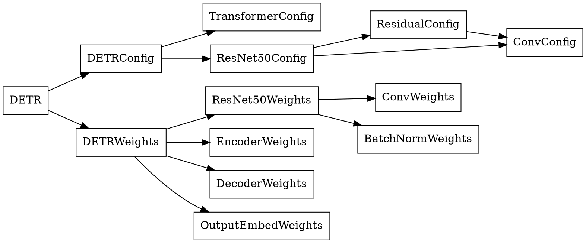

# DETR pure C simulation with Python vefirication

## Project Information
- version: v1.0.0
- date: 2025-05-03
- author: Eason Yeh (Hsuan-Yu Yeh)
- email: `easonyehmobile1@gmail.com`

## Abstract
This repository contains a pure C simulation of the DETR (DEtection TRansformer) model. The code is designed to be portable and can be compiled on various platforms, including Linux and Windows. The simulation includes the model architecture, weight loading, and inference functionalities.

Additionally, a Python verification script is provided to ensure the correctness of the C implementation. The Python script compares the output of the C simulation with the output of a PyTorch implementation of DETR, allowing for easy validation of the C code.

Weights are loaded from a custom binary format, which is designed to be efficient and easy to parse. The binary format includes the model configuration, weights, and input data.

The C simulation is designed to be modular and easy to extend, making it suitable for educational purposes and further research in the field of object detection and transformer models.

---
## File structure
The file structure of the project is organized as follows:
```
DETR
├── Csim
│   ├── src
│   │   ├── model.c
│   │   └── statistic.c
│   ├── include
│   │   ├── model.c
│   │   └── statistic.c
│   └── detr.c
├── model_bundle
│   ├── config.json
│   ├── detr_weights.bin
│   └── model_input.bin
├── Python
│   ├── Analyzer.py
│   ├── CsimVerify.py
│   ├── ModelInference.py
│   ├── ModelWeight.py
│   └── requirements.txt
├── .clang-format
├── .gitignore
├── Makefile
└── README.md
```
---
## Data Structures
The data structures used in the C simulation are designed to represent the various components of the DETR model. The main structures include:
- `DETR`: Represents the overall DETR model, including its configuration and weights.
- `DETRConfig`: Contains the configuration parameters for the DETR model, such as the number of classes, input size, and other hyperparameters.
- `DETRWeights`: Contains the weights for the DETR model, including the weights for the backbone (ResNet50), encoder, decoder, and output embedding layers.


## Call stacks
The call stacks for the main functions in the C simulation are as follows:
```
forward
├── malloc_encoder_run_state
├── malloc_decoder_run_state
├── forward_resnet50
│   ├── conv2D
│   │   └── malloc_conv2D_run_state
│   ├── BatchNorm
│   ├── relu
│   ├── maxpooling2D
│   │   └── malloc_conv2D_run_state
│   ├── add
│   └── free_conv2D_run_state
├── memcpy (multiple calls)
├── forward_encoder
│   ├── add
│   ├── gemm
│   ├── softmax
│   ├── relu
│   └── layernorm
├── forward_decoder
│   ├── add
│   ├── gemm
│   ├── softmax
│   ├── relu
│   ├── layernorm
│   └── memcpy
├── forward_output
│   ├── gemm
│   ├── relu
│   └── sigmoid
├── free_encoder_run_state
└── free_decoder_run_state
```

## weight binary file format
The binary file format for the weights is designed to be efficient and easy to parse. The format includes a header and a series of data sections. The header contains metadata about the model, such as the version, tensor count, and offsets for different sections of the file.

The header is structured as follows:
```c
typedef struct {
  uint32_t version;
  uint32_t num_tensor;
  uint32_t pack_method;
  uint32_t info_offset;
  uint32_t name_offset;
  uint32_t data_offset;
} TensorFile;
```

The data sections are structured as follows:
```c
typedef struct {
  uint32_t id;
  uint32_t data_type;
  uint32_t data_offset;
  uint32_t data_size;
  uint32_t name_offset;
  uint32_t name_size;
} TensorInfo;
```
The data sections contain the actual weights and configuration parameters for the model. Each section is identified by its ID and contains information about its data type, size, and offset within the file.

## Model prepare and inference by Python

The Python scripts provided in the `Python` directory allow for preparing the model and performing inference using the PyTorch implementation of DETR. These scripts are designed to work seamlessly with the C simulation for verification purposes.

### Preparing the Model
To prepare the model, you can use the `ModelWeight.py` script. This script converts the PyTorch model weights into the custom binary format required by the C simulation. Run the following command to generate the weight file:
```bash
mkdir -p model_bundle
mkdir -p output

python3 Python/ModelWeight.py \
		--repo_or_dir 'facebookresearch/detr:main'\
		--model 'detr_resnet50'\
		--output 'model_bundle/detr_weights.bin'\
		--list true
```
Or you can run `make py_gen_weights` directly.

### Performing Inference
To perform inference using the PyTorch implementation, use the `ModelInference.py` script. This script takes the input data and generates the output bounding boxes and scores. Run the following command:
```bash
mkdir -p $(INPUT_DIR)
mkdir -p $(PYTHON_OUTPUT_DIR)

python3 Python/ModelInference.py \
		--repo_or_dir 'facebookresearch/detr:main'\
		--model 'detr_resnet50'\
		--bin_output 'output/python'\
		--image_path './demo_images/horse.jpg'\
		--verbose

cp output/python/model_input.bin model_bundle
```
Where:
- `--repo_or_dir`: Specifies the repository or directory containing the DETR model (e.g., `'facebookresearch/detr:main'`).
- `--model`: The name of the pre-trained model to use (e.g., `'detr_resnet50'`).
- `--bin_output`: Path to save the binary output generated by the script (e.g., `'output/python'`).
- `--image_path`: Path to the input image for inference (e.g., `'./demo_images/horse.jpg'`).
- `--verbose`: Enables detailed logging during the inference process.

Or you can run `make py_inference` directly.

After running the script, the input binary file (`model_input.bin`) will be copied to the `model_bundle` directory for use in the C simulation.

These scripts ensure that the PyTorch implementation is aligned with the C simulation, enabling accurate verification and testing.

## C simulation Compilation
To compile the C simulation, you can use the provided Makefile. The Makefile is designed to work with both Linux and Windows platforms. To compile the code, simply run the following command in the terminal:
```bash
make build [DEBUD=1] [DUMP=1] [ANALYZE=1]
```
This will compile the C simulation and generate an executable file named `detr` in the root directory. The optional flags are:
- `DEBUG=1`: Enables debug mode for additional logging and debugging information.
- `DUMP=1`: Enables dumping of intermediate results for analysis.
- `ANALYZE=1`: Enables performance analysis during execution.

After compilation, you can run the simulation using the following command:
```bash
./detr <config_file> <weight_file> <input_file> <out_box_file> <out_score_file>
```
Where:
- `<config_file>`: Path to the configuration file (e.g., `model_bundle/config.json`).
- `<weight_file>`: Path to the weights file (e.g., `model_bundle/detr_weights.bin`).
- `<input_file>`: Path to the input data file (e.g., `model_bundle/model_input.bin`).
- `<out_box_file>`: Path to the output bounding box file (e.g., `output_box.bin`).
- `<out_score_file>`: Path to the output score file (e.g., `output_score.bin`).

Alternatively, you can use `make run` to execute the simulation with default paths configured in the `Makefile`.

## Python Verification
The Python verification script is designed to compare the output of the C simulation with the output of a PyTorch implementation of DETR. The script loads the same weights and input data used in the C simulation and performs inference using both implementations. The outputs are then compared to ensure that they match within a specified tolerance.
The verification script can be run using the following command:
```bash
python3 Python/CsimVerify.py \
    --csim output/Csim/debug \
		--golden output/Python \
		--data_type 'fp32' \
		--rtol 1e-6 \
		--atol 1e-4
```
Where:
- `--csim`: Path to the output directory of the C simulation results (e.g., `output/Csim/debug`).
- `--golden`: Path to the output directory of the PyTorch implementation results (e.g., `output/Python`).
- `--data_type`: Data type of the results to compare (e.g., `fp32` for 32-bit floating point).
- `--rtol`: Relative tolerance for comparison (e.g., `1e-6`).
- `--atol`: Absolute tolerance for comparison (e.g., `1e-4`).

Note: Before verifying the C simulation, ensure that you compile the C simulation with the `DUMP=1` flag enabled. Additionally, run the `ModelInference.py` script beforehand to generate both the C simulation output (csim) and the golden tensor binary for comparison.

## Python Analyze

The `Analyzer.py` script is designed to analyze and visualize statistical data generated during the C simulation. It processes the data, computes key metrics, and generates plots to help identify performance bottlenecks and validate the simulation results.

### Features
- **Arithmetic Intensity Analysis**: Calculates the ratio of FLOPs to data movement for each operation and visualizes it as a histogram.
- **Operation Statistics**: Computes average and total statistics for each operation, including FLOPs, MACs, memory reads, and writes.
- **Visualization**: Generates bar plots for key metrics such as FLOPs, MACs, memory reads, memory writes, and data movement.
- **CSV Export**: Saves processed data, including averages and sums, to new CSV files for further analysis.

### Running the Analyzer
To run the analysis, use the following command:
```bash
python3 Python/Analyzer.py \
    --input_csv output/statistics.csv \
    --out_dir output/
```

Where:
- `-i` or `--input_csv`: Path to the input CSV file containing statistical data (e.g., `output/statistics.csv`).
- `-o` or `--out_dir`: Directory to save the analysis results and generated plots (e.g., `output/`).

Or you can run `make py_analyze` directly.

### Outputs
1. **Plots**:
   - `Arithmetic_Intensity.png`: Histogram of arithmetic intensity for each operation.
   - Bar plots for metrics such as FLOPs, MACs, memory reads, memory writes, and data movement.

2. **CSV Files**:
   - `<input_csv>_out.csv`: Processed data with additional computed metrics.
   - `<input_csv>_avg.csv`: Average statistics for each operation.
   - `<input_csv>_sum.csv`: Total statistics for each operation.

### Key Metrics
- **MACs**: Maximum of ADD and MUL operations for each row.
- **FLOPs**: Sum of ADD, MUL, DIV, and non-linear operations.
- **Data Movement**: Sum of memory reads and writes.
- **Arithmetic Intensity**: Ratio of FLOPs to data movement.

### Notes
- Ensure the input CSV file contains the required columns: `Operation Name`, `ADD`, `MUL`, `DIV`, `Non-Linear Operations`, `Memory Read`, and `Memory Write`.
- The output directory must be writable to save plots and processed data.
- Before running the analysis, ensure that you compile the C simulation with the `ANALYZE=1` flag enabled. This will generate the necessary statistical data in the specified output directory for further processing by the `Analyzer.py` script.

This script is a powerful tool for analyzing performance metrics and identifying bottlenecks in computational workflows.

---

## Conclusion

This repository provides a comprehensive framework for simulating, verifying, and analyzing the DETR model using both C and Python implementations. The modular design of the C simulation, combined with the Python scripts for verification and analysis, ensures accuracy and flexibility. This project is ideal for educational purposes, research, and performance optimization in object detection and transformer-based models.

For any questions or issues, feel free to contact the author at `easonyehmobile1@gmail.com`.

Happy coding!