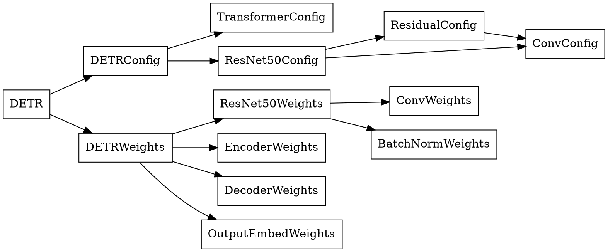

# DETR pure C simulation

## File structure
```
DETR
├── Csim
│   ├── README.md
│   ├── detr.c
│   ├── src
│   │   └── model.c
│   ├── Makefile
│   └── include
│       └── model.h
└── Python
```
## Data Structures

## Call stacks
```
forward
├── malloc_encoder_run_state
├── malloc_decoder_run_state
├── forward_resnet50
│   ├── conv2D
│   │   └── malloc_conv2D_run_state
│   ├── BatchNorm
│   ├── relu
│   ├── maxpooling2D
│   │   └── malloc_conv2D_run_state
│   ├── add
│   └── free_conv2D_run_state
├── memcpy (multiple calls)
├── forward_encoder
│   ├── add
│   ├── gemm
│   ├── softmax
│   ├── relu
│   └── layernorm
├── forward_decoder
│   ├── add
│   ├── gemm
│   ├── softmax
│   ├── relu
│   ├── layernorm
│   └── memcpy
├── forward_output
│   ├── gemm
│   ├── relu
│   └── sigmoid
├── free_encoder_run_state
└── free_decoder_run_state
```

## weight binary file format
- custom format (.bin)
